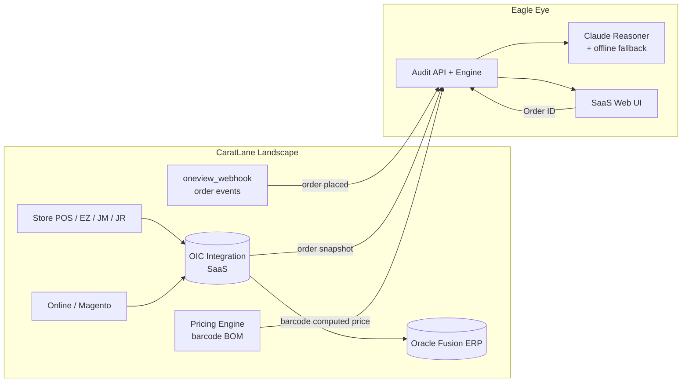
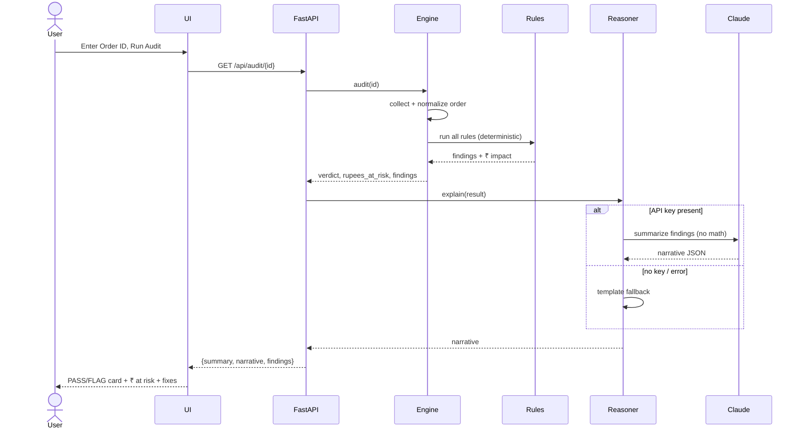
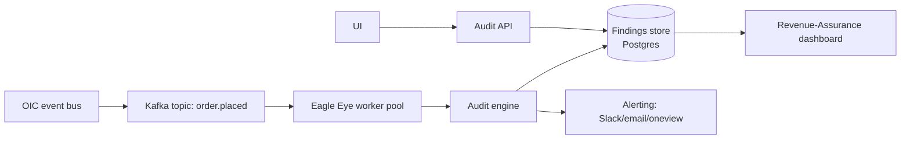

# Eagle Eye — High-Level Design (HLD)

> **Watching Every Transaction. Predicting Every Risk. Protecting Every Fulfillment.**
> AI-powered, order-level revenue-assurance audit for CaratLane.

| | |
|---|---|
| **Document** | High-Level Design |
| **Project** | Eagle Eye (CaratLane Hackathon) |
| **Version** | 1.0 |
| **Status** | Demo complete; production design proposed |
| **Audience** | Architects, ERP/Integration team, Revenue Assurance, Hackathon judges |

---

## 1. Purpose & background

CaratLane orders flow across a multi-hop landscape:

```
Store POS / Web (Magento)  ─▶  OIC (SaaS integration)  ─▶  PaaS sync  ─▶  Oracle Fusion ERP  ─▶  PaaS sync back
```

Across these hops, **revenue silently leaks**: a barcode priced below its BOM, a discount
beyond policy, a coupon that produced no value, a missing invoice push, an impossible
delivery date, or a sub-inventory transfer (ITR) that never reconciled between what was
**ordered** and what was **fulfilled**.

Traditional SOC2 / Drools-style audits are **periodic, generic, and rule-DSL heavy**.
Eagle Eye instead audits **every order, the moment it is placed**, against CaratLane's
**actual business rules**, and returns a clear **PASS / FLAG** verdict with the **₹ at risk**.

### Goals
- Audit a single order end-to-end in **< 2 seconds** from an Order ID.
- Detect **revenue leakage** across pricing, discount, coupon, invoice, delivery, ITR, and
  order-restriction modules.
- Produce **human-readable, auditor-grade explanations** + a suggested fix per issue.
- **Zero false approvals on money**: all monetary decisions are deterministic.
- **Zero infra cost** for the demo; trivially cheap in production.

### Non-goals (for the hackathon)
- Auto-correcting orders (Eagle Eye flags; remediation is human/another system).
- Real-time event wiring to OIC (simulated via Order-ID input/webhook stub).
- Full master-data governance (we model the policy thresholds we need).

---

## 2. Design principle — "Hybrid Safety"

> **The LLM interprets and explains. Deterministic code decides.**

This is the single most important architectural decision and is borrowed (correctly) from
the agentic-rules-engine pattern.

| Concern | Owner | Why |
|---|---|---|
| Does the money reconcile? Pass/Fail? ₹ impact? | **Deterministic Python** | An LLM will hallucinate arithmetic and could *approve a leaking order*. |
| Severity narrative, root-cause wording, fix suggestion, free-text anomaly catch-all | **Claude (LLM)** | Flexible language understanding; explains like a senior auditor. |

If Claude is unavailable (no API key / network), a **template reasoner** produces the same
structured narrative — so the audit verdict is **never** dependent on the LLM.

---

## 3. System context (C4 — Level 1)



---

## 4. Logical architecture (C4 — Level 2: containers/components)

```mermaid
flowchart TD
    UI[Web UI  (SPA, dark SaaS)] -->|HTTP/JSON| SRV[FastAPI server]
    SRV --> COL[Collector / loader.py]
    COL -->|fixture| FX[(data/orders/*.json)]
    COL -->|live stub| OIC[(OIC / Fusion REST)]
    COL --> NORM[Normalizer + schema.py]
    NORM --> ENG[Rule Engine engine.py]
    ENG --> RULES[Rule Catalog rules.py]
    ENG --> CFG[Policy Config config.py]
    ENG --> RES[AuditResult\nverdict + ₹ risk + findings]
    RES --> REA[Reasoner reasoner.py]
    REA -->|key set| CLAUDE[Claude API]
    REA -->|no key| TMPL[Template fallback]
    REA --> SRV
    SRV --> UI
```

**Four stages, single responsibility each:**

1. **COLLECT** (`loader.py`) — fetch the order snapshot from fixture / OIC / webhook and
   **normalize** it (flatten `ORDER DETAIL` + `FULFILLMENT DETAIL`, safe-parse money).
2. **DECIDE** (`engine.py` + `rules.py` + `config.py`) — run every rule, aggregate
   structured findings, compute verdict + ₹ at risk. **Source of truth.**
3. **EXPLAIN** (`reasoner.py`) — Claude (or fallback) turns findings into a narrative.
4. **PRESENT** (`server.py` + `web/`) — REST API + SaaS UI render the verdict card.

---

## 5. Audited modules (functional coverage)

| Module | What Eagle Eye verifies | Leakage prevented |
|---|---|---|
| **Pricing (barcode/SKU)** | line price == barcode BOM (metal+making+stone); tax @ GST; totals tie out | underbilling / mispriced barcode |
| **Discount** | item + order discount within channel cap | unauthorised over-discount |
| **Coupon / points** | coupon code ⇄ discount value consistency | dead coupons / value without code |
| **Invoice push** | shippable item has invoice number synced to ERP | unbillable shipped goods |
| **Delivery dates** | EDD present and not before order date | SLA breach / impossible dates |
| **Sub-inventory transfer (ITR)** | `ORDER DETAIL` vs `FULFILLMENT DETAIL` barcode/price/amount match | transfer/sync mismatch |
| **Manufacturing/Procurement** | (extensible hook) item BOM/components present | sourcing gaps |
| **Customer info** | customer id/name/email present & valid | bad master data |
| **Address info** | pincode (6-digit) + state present | undeliverable / wrong GST jurisdiction |
| **Order-level restrictions** | channel rules (ONLINE payment, OLDGOLD buy-back value, financial approval for high value) | policy bypass |

Order types covered: **EZ, JM, JR, Online, Old Gold**.

---

## 6. Technology stack

| Layer | Choice | Rationale |
|---|---|---|
| Engine | **Python 3 (stdlib only)** | Zero-dependency core → CLI always runs; fast to build in 24h |
| API | **FastAPI + Uvicorn** | Async, typed, auto OpenAPI docs, one-file server |
| UI | **Vanilla HTML/CSS/JS (no build)** | Zero toolchain, hostable anywhere, fast |
| LLM | **Claude (`claude-haiku-4-5`)** | Cheap, fast, strong reasoning; optional via env |
| Fallback | **Template reasoner** | Guarantees demo works offline at ₹0 |
| Data (demo) | **JSON fixtures** mirroring `validate_order_json2.yml` | Stable demo; one-function swap to live |

---

## 7. Data flow (runtime sequence)



---

## 8. Deployment view

**Hackathon (current):** single host, single process.
```
python server.py  →  http://127.0.0.1:8000   (serves API + static SPA)
```

**Production (proposed):**

Containerized (Docker), horizontally scalable workers, stateless engine, findings persisted.

---

## 9. Cross-cutting concerns

| Concern | Approach |
|---|---|
| **Resilience** | A buggy rule is caught per-rule; never crashes the audit. LLM failure → fallback. |
| **Security** | Read-only on order data; secrets via env; no PII sent to LLM beyond what's needed (free-text only). |
| **Cost** | Core engine free; Claude on Haiku ≈ fractions of a cent/order; fallback = ₹0. |
| **Observability** | Structured findings are log-friendly; each finding carries rule_id for traceability. |
| **Extensibility** | Add a rule = one function + one list entry. Thresholds in `config.py`. |
| **Auditability** | Deterministic engine = reproducible verdict; LLM output is explanatory only. |

---

## 10. Risks & mitigations

| Risk | Mitigation |
|---|---|
| LLM hallucinates numbers | LLM never computes money; engine is source of truth |
| Live OIC auth blocks demo | Build on fixtures; live fetch is an isolated stub |
| Master data (caps/GST) unknown | Centralised in `config.py`; sourced from policy in prod |
| Order schema drift | Normalizer isolates field mapping in one place |

See **LLD.md** for module-level detail and **REQUIREMENTS.md** for production gaps.
